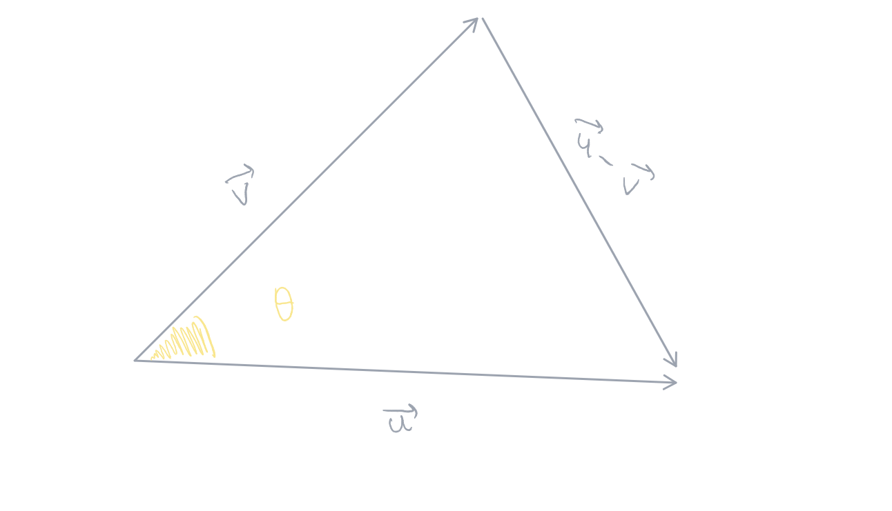
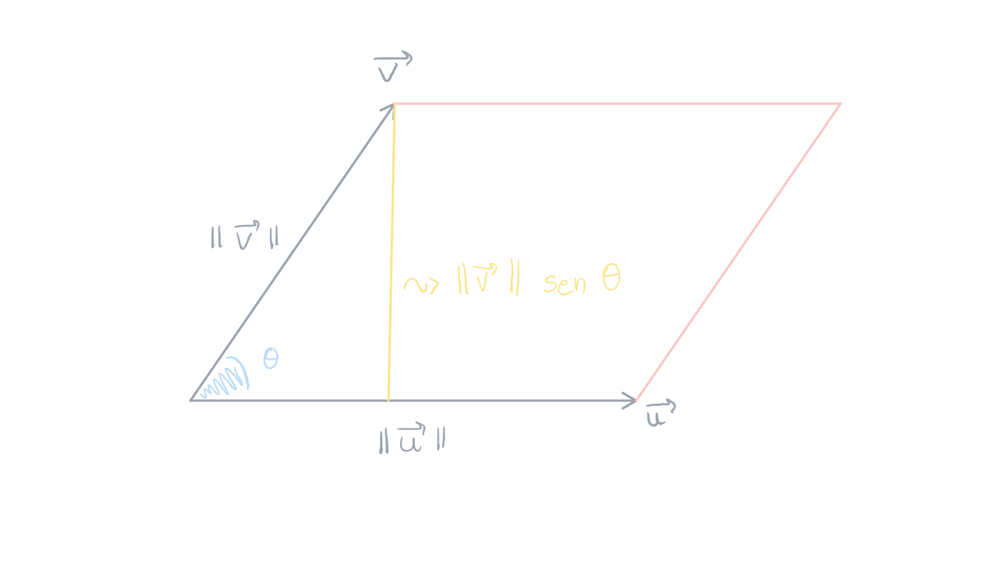

public:: true

- Created: [[May 6th, 2026]] 
  Updated: [[May 23rd, 2026]] 
  Subject: [[Vetores no R2 e R3]] 
  Tags:
- card-last-interval:: -1
  card-repeats:: 1
  card-ease-factor:: 2.6
  card-next-schedule:: 2026-06-02T03:00:00.000Z
  card-last-reviewed:: 2026-06-01T18:04:26.388Z
  card-last-score:: 1
  #+BEGIN_QUOTE
  **Definição**: se $\overrightarrow{u}$ e $\overrightarrow{v}$ forem vetores não nulos em $R^{3}$ ou $R^{3}$ e se $\theta$ for o ângulo entre $\overrightarrow{u}$ e $\overrightarrow{v}$, então o *produto escalar*, também denominado *produto interno euclidiano*, de $\overrightarrow{u}$ e $\overrightarrow{v}$ é denotado por $\overrightarrow{v}•\overrightarrow{v}$ e definido por 
  #+BEGIN_CENTER
   
  $\overrightarrow{v}\space•\space\overrightarrow{v}=||\overrightarrow{u}||\space||\overrightarrow{v}||\space\cos\theta$
  #+END_CENTER 
  #+END_QUOTE
  **Demonstração**: #card
  
	- Pela **Lei dos Cossenos**, temos:
	  #+BEGIN_CENTER
	  $||\overrightarrow{u}-\overrightarrow{v}||^{2}=||\overrightarrow{u}||^{2}+||\overrightarrow{v}||^{2}-2\space||\overrightarrow{u}||+||\overrightarrow{v}||\space\cos\theta$
	  
	  $||\overrightarrow{u}||^{2}-2\times\overrightarrow{u}\times\overrightarrow{v}+||\overrightarrow{v}^{2}||=||\overrightarrow{u}||^{2}+||\overrightarrow{v}||^{2}-2\space||\overrightarrow{u}||+||\overrightarrow{v}||\space\cos\theta$
	  
	  $\overrightarrow{||u||}^{2}-2\times\overrightarrow{u}\times\overrightarrow{v}+\overrightarrow{||v||}^{2}-\overrightarrow{||v||}^{2}=-2\space||\overrightarrow{u}||+||\overrightarrow{v}||\space\cos\theta$
	  
	  $(\frac{1}{-2})(-2\times\overrightarrow{u}\times\overrightarrow{v})=(-2\times\overrightarrow{v}\times\overrightarrow{v}\times\cos\theta)(\frac{1}{-2})$
	  
	  $\overrightarrow{v}\space•\space\overrightarrow{v}=||\overrightarrow{u}||\space||\overrightarrow{v}||\space\cos\theta$
	  #+END_CENTER
- ## Identidade de Lagrange 
  #+BEGIN_QUOTE 
  #+BEGIN_CENTER
  $||\overrightarrow{v}\times\overrightarrow{u}||^{2}=||\overrightarrow{u}||^{2}\space||\overrightarrow{v}||^{2}-(\overrightarrow{u}\space•\space\overrightarrow{v})^{2}$
  #+END_CENTER 
  #+END_QUOTE
  
  Se $\theta$ denota o ângulo entre $\overrightarrow{u}$ e $\overrightarrow{v}$, então $\overrightarrow{v}\space•\space\overrightarrow{v}=||\overrightarrow{u}||\space||\overrightarrow{v}||\space\cos\theta$, de modo que a **Identidade de Lagrange** pode ser reescrita como:
  
  #+BEGIN_CENTER
  $||\overrightarrow{v}\times\overrightarrow{v}||^{2}=||\overrightarrow{u}||^{2}\space||\overrightarrow{v}||^{2}\space-||\overrightarrow{u}||^{2}\space||\overrightarrow{v}||^{2}\cos^{2}\theta$
   
  $=||\overrightarrow{u}||^{2}\space||\overrightarrow{v}||^{2}\space(1-\cos^{2}\theta)$
   
  $=||\overrightarrow{u}||^{2}\space||\overrightarrow{v}||^{2}\space\sin^{2}\theta$
   
  $||\overrightarrow{v}\times\overrightarrow{v}||=||\overrightarrow{u}||\space||\overrightarrow{v}||\space\sin\theta$
  #+END_CENTER
  
  Mas $||\overrightarrow{v}||\space\sin\theta$ é a altura do paralelogramo determinado por $\overrightarrow{u}$ e $\overrightarrow{v}$. Assim, a área do paralelogramo é dada por: 
  #+BEGIN_CENTER
   
  $A=||\overrightarrow{u}||\space||\overrightarrow{v}||\space\sin\theta=||\overrightarrow{u}\times\overrightarrow{v}||$
  #+END_CENTER