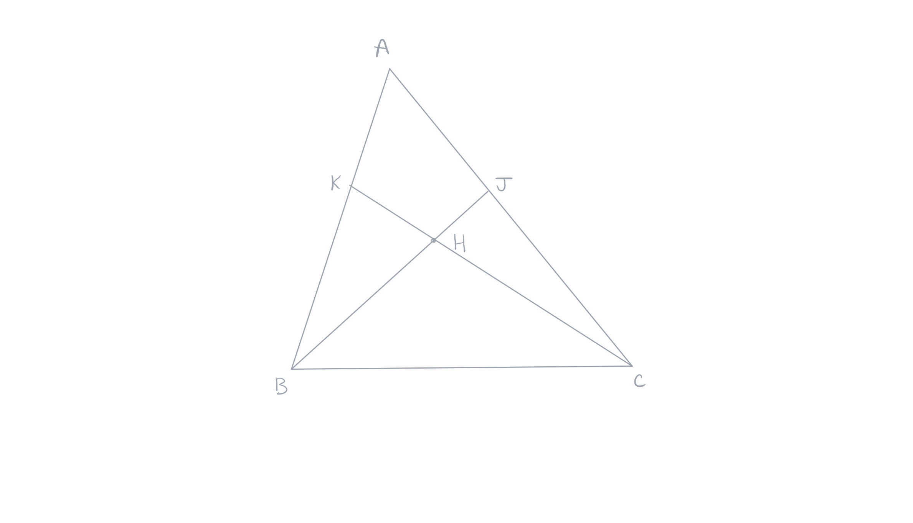
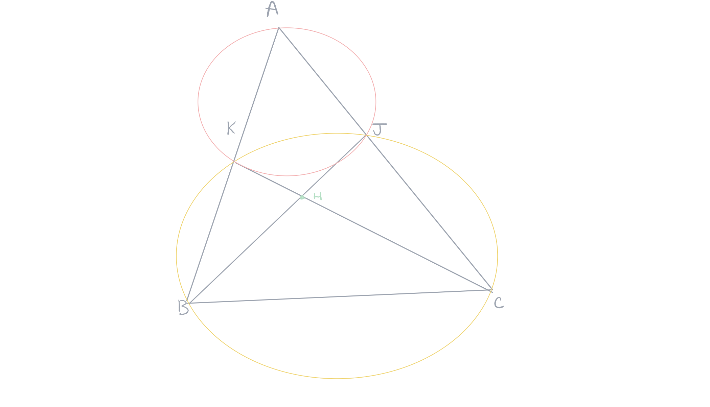
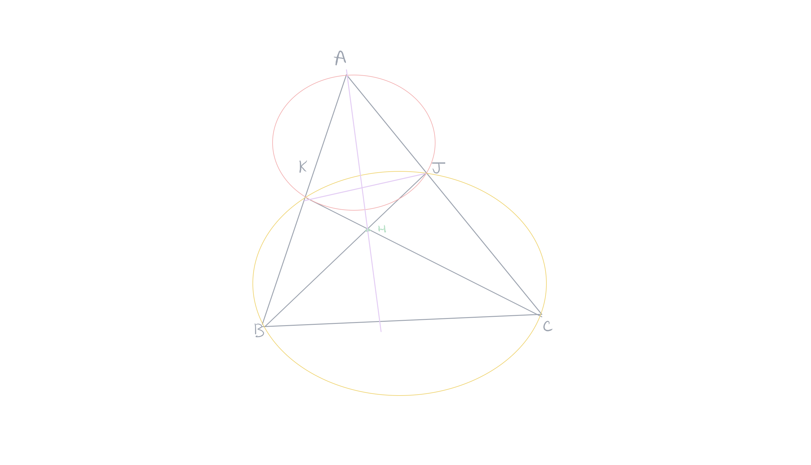

public:: true

- Created: [[May 26th, 2026]] 
  Updated:
  Subject: [[Geometria Euclidiana]] 
  Tags:
-
- ## 1. Teorema 
  #+BEGIN_QUOTE
  As três alturas de um triângulo se encontram em um ponto chamado o ortocentro do triângulo.
  #+END_QUOTE
  **Demonstração**: seja um triângulo $ABC$ e duas alturas $(BJ)$ e $(CK)$. Elas se encontram em um ponto $H$. Mostre que a reta $(AH)$ é a terceira altura, ou seja, a reta $(AH)$ é perpendicular ao lado $BC$.
  
	-  
	  Considerando o quadrilátero $AKHJ$, observamos que os ângulos em $K$ e $J$ são retos. Logo os pontos $A$, $K$, $H$, $J$ pertençam ao círculo de diâmetro $AH$. Pela mesma razão os vértices do quadrilátero $BKJC$ pertençam ao círculo do diâmetro $BC$. Vamos traçar estes círculos, assim como traçar $AH$ até encontrar $BC$ em $I$.
	   
	  O quadrilátero $AKHI$ sendo inscrito no círculo de diâmetro $AH$, os ângulos inscritos $HAJ$ e $HKJ$ interceptam o mesmo arco $HJ$, logo são iguais. O quadrilátero $BKJC$ sendo inscrito no círculo de diâmetro $BC$, os ângulos inscritos $HKJ$ e $JBC$ interceptam o mesmo arco $JC$, logo são iguais.
	  Deduz-se que os ângulos $HAJ$ e $JBC$ são iguais. 
	  Os ângulos $HAJ$ e $AHJ$ são complementares pois o triângulo $HAJ$ é um triângulo retângulo em $J$. O ângulo $AHJ$ é oposto pelo vértice ao ângulo $BHI$. Logo, $JBC$ e $BHI$ são complementares, o que demonstra que $AH$ e $BC$ são perpendiculares, e que, portanto, $AH$ é a terceira