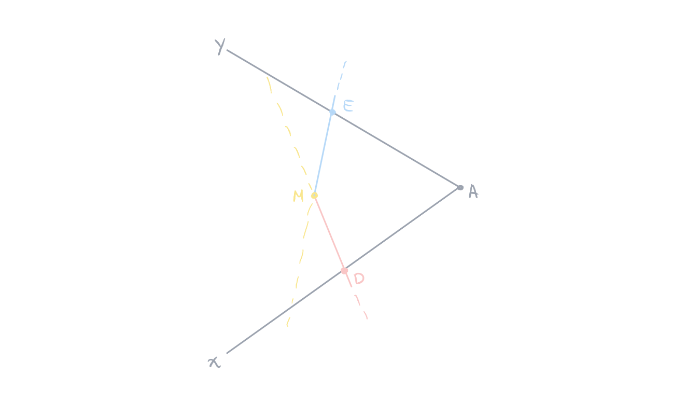
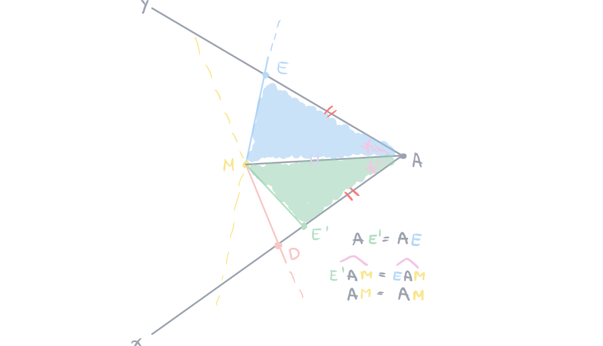
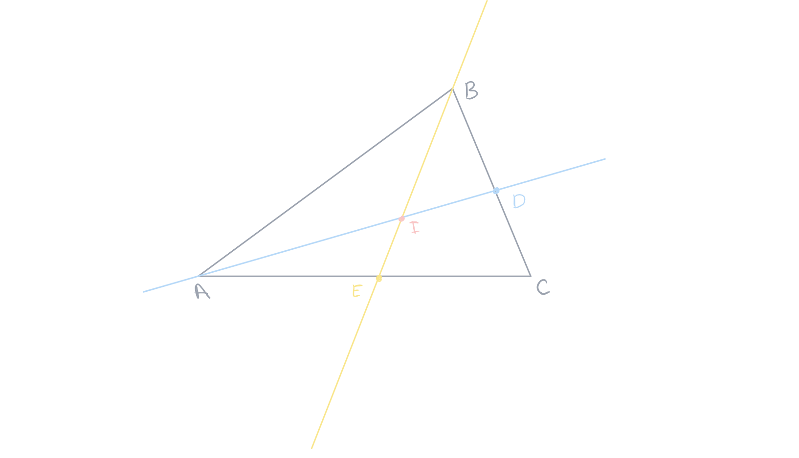
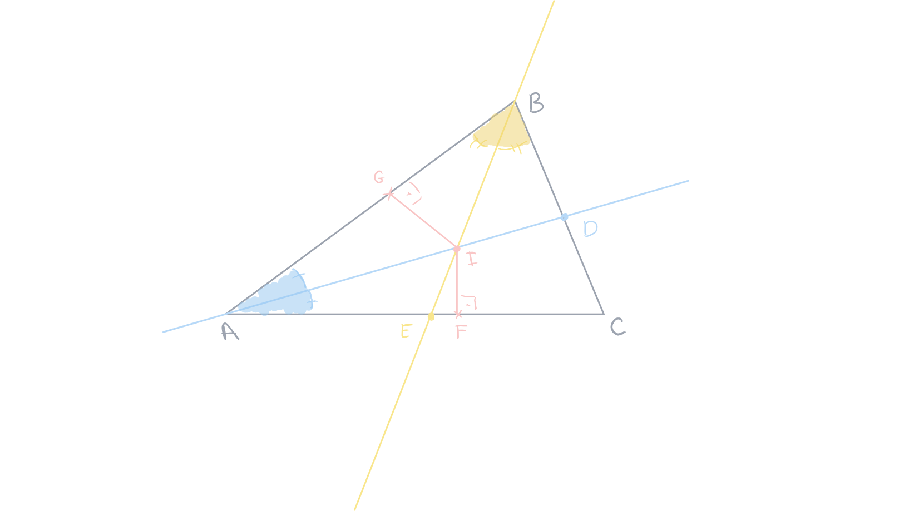
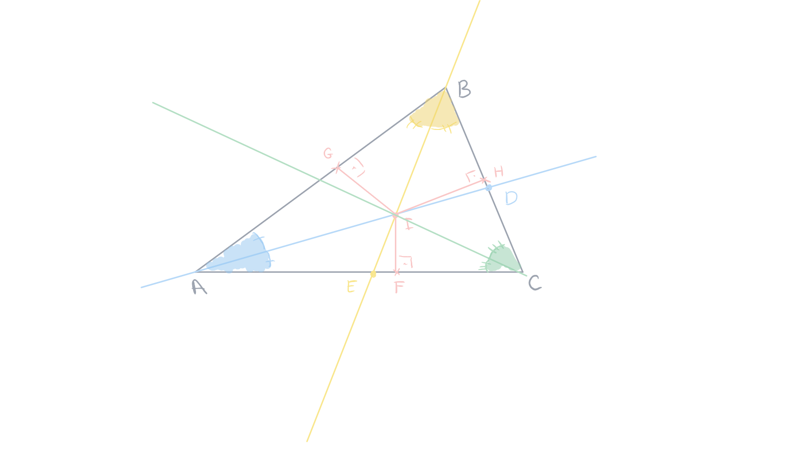
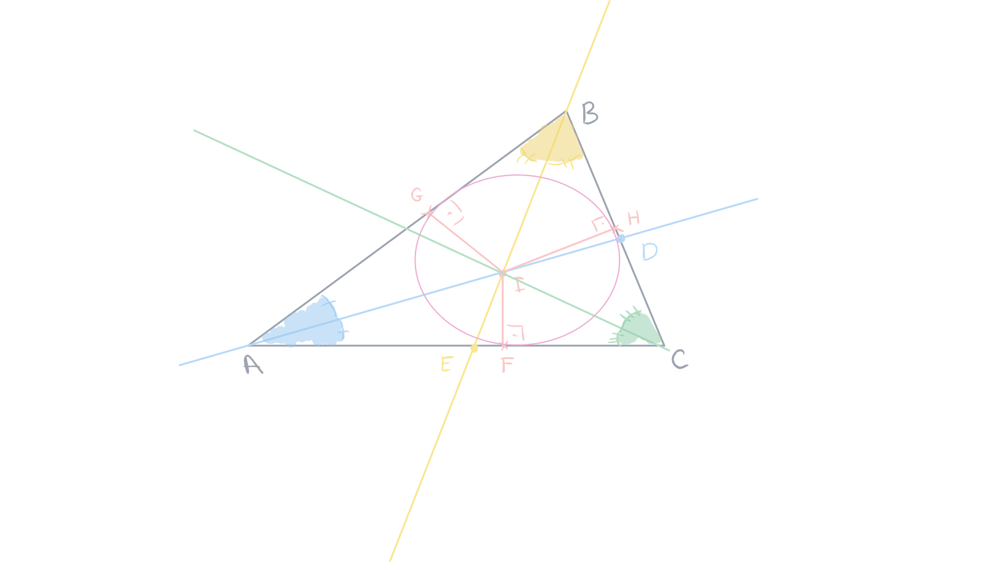

public:: true

- Created: [[May 14th, 2026]] 
  Updated: [[May 16th, 2026]] 
  Subject: [[Geometria Euclidiana]]
- ## 1. Teorema[^1]
  #+BEGIN_QUOTE
  Para todo ponto $M$, se $M$ pertence à bissetriz interna do ângulo $\widehat{xAy}$, então $M$ é **equidistante** das duas retas $(AX)$ e $(Ay)$.
  #+END_QUOTE
  **Demonstração**: seja *M* um ponto pertencendo à bissetriz do ângulo $\widehat{xAy}$. Ao traçar as retas perpendiculares passando por $M$ às duas semirretas $[Ax)$ e $[Ay)$, essas perpendiculares encontram as semirretas respectivamente em $D$ e $E$. Assim, é possível montrar que $MD=ME$.
  
	- Supondo que $AE\not{AD}$, supomos que $AE<AD$, logo existe um ponto $E'$ no segmento $[AD]$ tal que $AE'=AE$. Comparando os triângulos $E'AM$ e $EAM$, temos: $\widehat{E'AM}=\widehat{EAM}$ pois $[AM)$ é a bissetriz.
	  
	  $AM$ é lado comum e $E'A=EA$.
	  
	  Pelo caso *LAL*[^1], os dois triângulos $E'AM$ e $EAM$ são congruentes, mas $EAM$ é um triângulo retângulo em $E$, logo $E'=D$, pois $MD$ é a única perpendicular à reta $(DA)$ passando por $M$. Temos, então: $ME'=MD=ME$
	   
	  
	  [^1]: **L** ($AE'=AE$), **A** ($\widehat{E'AM}=\widehat{EAM}$), **L** ($AM=AM$)
	-
- ## 1.2 Teorema
  #+BEGIN_QUOTE
  As bissetrizes internas de um triângulo são concorrentes em um ponto chamado de incentro por ser o centro do círculo inscrito.
  #+END_QUOTE
  **Demonstração**: seja um triângulo $ABC$ e duas bissetrizes $(AD)$ e $(BE)$ respectivamente dos ângulos $\widehat{BAC}$ e $\widehat{ABC}$. As duas bissetrizes se encontram em um ponto $I.$ Mostre que $CI$ é a terceira bissetriz.
  
	- O fato de $(AD)$ ser a bissetriz de $\widehat{BAC}$ faz com que $\widehat{BAD}=\widehat{CAD}$. O mesmo vale para os ângulos $\widehat{ABE}$ e $\widehat{CBE}$ que são iguais por serem ângulos cortados pela bissetriz $(BE)$.
	  
	  As duas bissetrizes concorrem num ponto $I$.
	  
	  Consideramos as bissetrizes de dois dos seus ângulos internos. As duas bissetrizes concorrem num ponto $I$.
	  
	  [^1]: Qualquer ponto que pertence às bissetrizes é equidistante dos dois lados daquele ângulo, ou seja, $I$ está na bissetriz $(AD)$ então ele é equidistante dos dois lados do ângulo $\widehat{BAC}$
	   
	  Como o ponto $I$ pertence à bissetriz do ângulo $\widehat{BAC}$, sabemos que ele é equidistante das retas $(AB)$ e $(AC)$. Entretanto, também é equidistante das retas $(AB)$ e $(BC)$, por estar na bissetriz do ângulo $ABC$. Assim, concluímos que o ponto $I$ é equidistante das retas $(AC)$ e $(BC)$, pelo que também pertence à bissetriz do ângulo $\widehat{ACB}$.
	  
	  Assim temos $IF=IG$.
	  Desenhando uma outra perpendicular, $IH$, a distância será a mesma pois $I$ é um ponto da bissetriz, ou seja, temos $IF=IG=IH$ então $IF=IH$. Mas se $IH$ é equidistante de dois lados de um ângulo, $I$ está em uma bissetriz do ângulo $\widehat{ACB}$. Logo, as bissetrizes internas de um triângulo são concorrentes em um ponto $I$.
	   
	  $I$ é o incentro do triângulo $ABC$, ou seja, é o centro de uma circunferência que é inscrita ao triângulo que é tangente aos três lados do triângulo.
	  