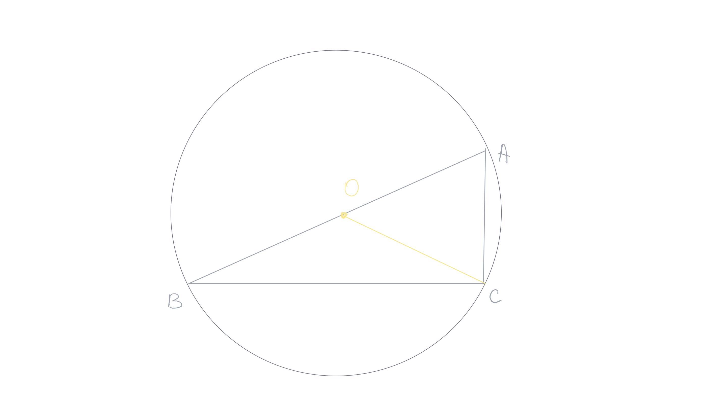
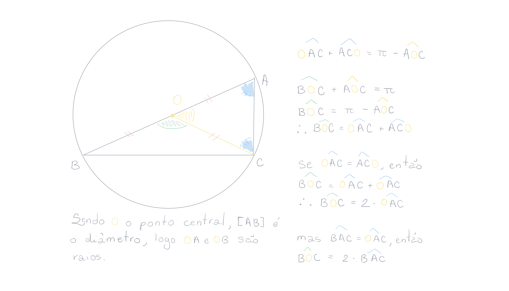

- Created: [[14-05-2026]] 
  Updated: [[15-05-2026]] 
  Subject: [[Geometria Euclidiana]]
  public:: true
- ## 1. Teorema
  #+BEGIN_QUOTE
  Para todo ponto $M$, se $M$ pertence à bissetriz interna do ângulo $\widehat{xAy}$, então $M$ é **equidistante** das duas retas $(AX)$ e $(Ay)$.
  #+END_QUOTE
  **Demonstração**: seja *M* um ponto pertencendo à bissetriz do ângulo $\widehat{xAy}$. Ao traçar as retas perpendiculares passando por $M$ às duas semirretas $[Ax)$ e $[Ay)$, essas perpendiculares encontram as semirretas respectivamente em $D$ e $E$. Assim, é possível montrar que $MD=ME$.
  
	- Supondo que $AE\not{AD}$, supomos que $AE<AD$, logo existe um ponto $E'$ no segmento $[AD]$ tal que $AE'=AE$. Comparando os triângulos $E'AM$ e $EAM$, temos: $\widehat{E'AM}=\widehat{EAM}$ pois $[AM)$ é a bissetriz.
	  
	  $AM$ é lado comum e $E'A=EA$.
	  
	  Pelo caso *LAL*[^1], os dois triângulos $E'AM$ e $EAM$ são congruentes, mas $EAM$ é um triângulo retângulo em $E$, logo $E'=D$, pois $MD$ é a única perpendicular à reta $(DA)$ passando por $M$. Temos, então: $ME'=MD=ME$
	   
	  
	  [^1]: **L** ($AE'=AE$), **A** ($\widehat{E'AM}=\widehat{EAM}$), **L** ($AM=AM$)
	-
- ## 1.2 Teorema
  #+BEGIN_QUOTE
  As bissetrizes internas de um triângulo são concorrentes em um ponto chamado de incentro por ser o centro do círculo inscrito.
  #+END_QUOTE
  **Demonstração**: seja um triângulo $ABC$ e duas bissetrizes $BJ$ e $CK$ respectivamente dos ângulos $ABC$ e $ACB$. As duas bissetrizes se encontram em um ponto $I.$ Mostre que $AI$ é a terceira bissetriz.
  
	- Consideramos as bissetrizes de dois dos seus ângulos internos. As duas bissetrizes concorrem num ponto $I$.
	  
	  Como o ponto $I$ pertence à bissetriz do ângulo $\widehat{BAC}$, sabemos que ele é equidistante das retas $(AB)$ e $(AC)$. Entretanto, também é equidistante das retas $AB)$ e $(BC)$, por estar na bissetriz do ângulo $ABC$. Assim, concluímos que o ponto $I$ é equidistante das retas $(AC)$ e $(BC)$, pelo que também pertence à bissetriz di ângulo $\widehat{ACB}$.
	  
	  Sejam $H$, $L$ e $G$ os pés das retas perpendiculares aos lados que passam por $I$. Como $I$ está à mesma distância das retas $(AB)$, $(BC)$ e $(AC)$, temos que os segmentos $[IH]=[IL]=[IG]$ são iguais. Assim, a circunferência de centro $I$ que passa num destes pontos, também passa nos outros dois.
	  
	  O ponto $I$, ponto de interseção das três bissetrizes, diz-se o incentro do triângulo e a circunferência tangente aos três lados do triângulo chama circunferência inscrita no triângulo.
	  
-
	- Supondo que $AE\not{AD}$, supomos que $AE<AD$, logo existe um ponto $E'$ no segmento $[AD]$ tal que $AE'=AE$. Comparando os triângulos $E'AM$ e $EAM$, temos: $\widehat{E'AM}=\widehat{EAM}$ pois $[AM)$ é a bissetriz.
	  
	  $AM$ é lado comum e $E'A=EA$.
	  
	  Pelo caso *LAL*[^1], os dois triângulos $E'AM$ e $EAM$ são congruentes, mas $EAM$ é um triângulo retângulo em $E$, logo $E'=D$, pois $MD$ é a única perpendicular à reta $(DA)$ passando por $M$. Temos, então: $ME'=MD=ME$
	  
	  
	  
	  [^1]: **L** ($AE'=AE$), **A** ($\widehat{E'AM}=\widehat{EAM}$), **L** ($AM=AM$)