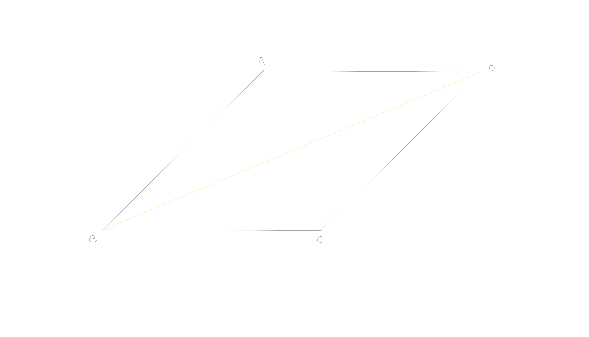
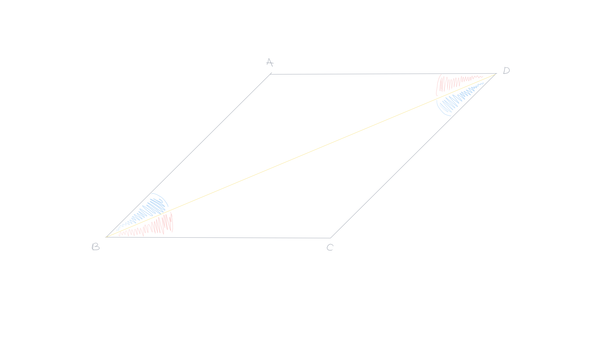
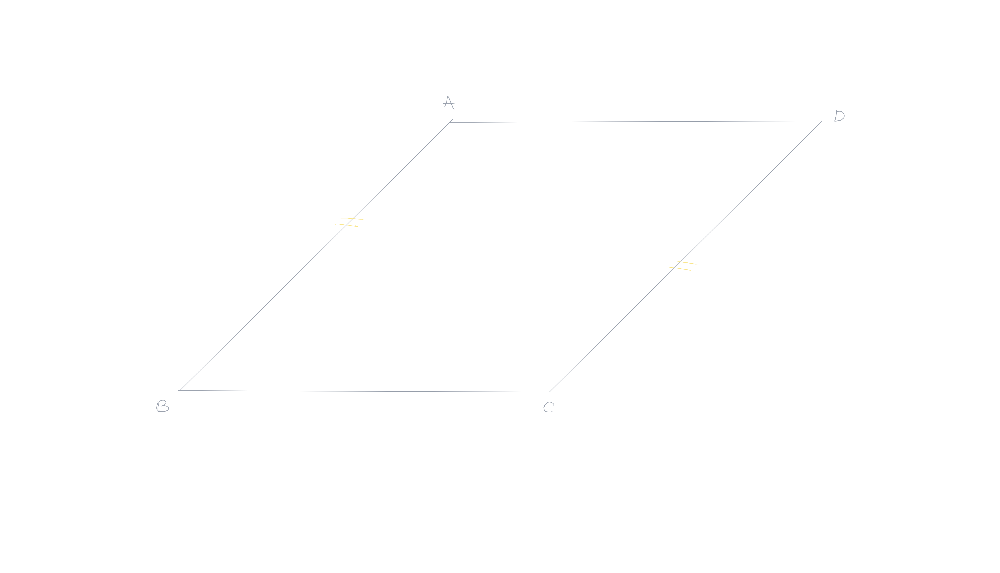
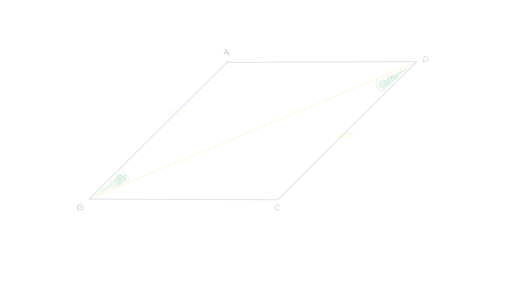

- Created: [[May 1st, 2026]] 
  Updated: [[May 31st, 2026]] 
  Subject: [[Geometria Euclidiana]] 
  Tags:
-
- ## 1^{a} Condição
  card-last-interval:: 4
  card-repeats:: 2
  card-ease-factor:: 2.6
  card-next-schedule:: 2026-06-05T18:04:22.245Z
  card-last-reviewed:: 2026-06-01T18:04:22.246Z
  card-last-score:: 5
  #+BEGIN_QUOTE
  Um paralelogramo tem seus **lados opostos iguais** e seus **ângulos opostos iguais**.
  #+END_QUOTE
  ---
  **Demonstração**: Considerando um paralelogramo $ABCD$, traçamos a diagonal $BD$. #card
  
	- Comparando os triângulos $ABD$ e $DBC$. Temos um **lado comum**, os ângulos **alternos-internos** $\widehat{DBA}$ e $\widehat{BDC}$ são iguais, os ângulos alternos-internos $\widehat{ADB}$ e $\widehat{DBC}$ são iguais. Então, pelo caso $ALA$, os triângulos são congruentes o que mostra que os lados opostos são iguais e que os ângulos opostos $\widehat{DAC}$ e $\widehat{BCD}$ são iguais.
	  
	  Por fim, como os ângulos $\widehat{DBA}$ e $\widehat{BDC}$ são iguais, e que os ângulos $\widehat{ADB}$ e $\widehat{DBC}$ são iguais, a soma dos ângulos $\widehat{ADB}$ e $\widehat{BDC}$ é igual a soma dos ângulos $\widehat{ABD}$ e $\widehat{DBC}$. Daí, os ângulos opostos $\widehat{ADC}$ e $\widehat{ABC}$ são iguais.
	  
- 2
- 3
- ## 4^{a} Condição
  card-last-score:: 5
  card-repeats:: 1
  card-next-schedule:: 2026-06-05T01:11:35.062Z
  card-last-interval:: 4
  card-ease-factor:: 2.6
  card-last-reviewed:: 2026-06-01T01:11:35.064Z
  #+BEGIN_QUOTE
  um quadrilátero convexo que **dois lados iguais** e **paralelos** é um **paralelogramo**.
  #+END_QUOTE
  ---
  **Demonstração**: Seja $ABCD$ um quadrilátero convexo que tem os seus lados $AB$ e $CD$ iguais e paralelos. #card
  
	- Comparando os triângulos $ABD$ e $CBD$ temos $BD$ lado comum, $AB=CD$ e os ângulos alternos internos $\widehat{ABD}$ e $\widehat{BDC}$ iguais. Os dois triângulos são, portanto congruentes. Logo os ângulos $\widehat{ADB}$ e $\widehat{DBC}$ são iguais. Esses ângulos são ângulos alternos internos em relação às retas $(AD)$ e $(BC)$, logo essas retas são paralelas.
	  