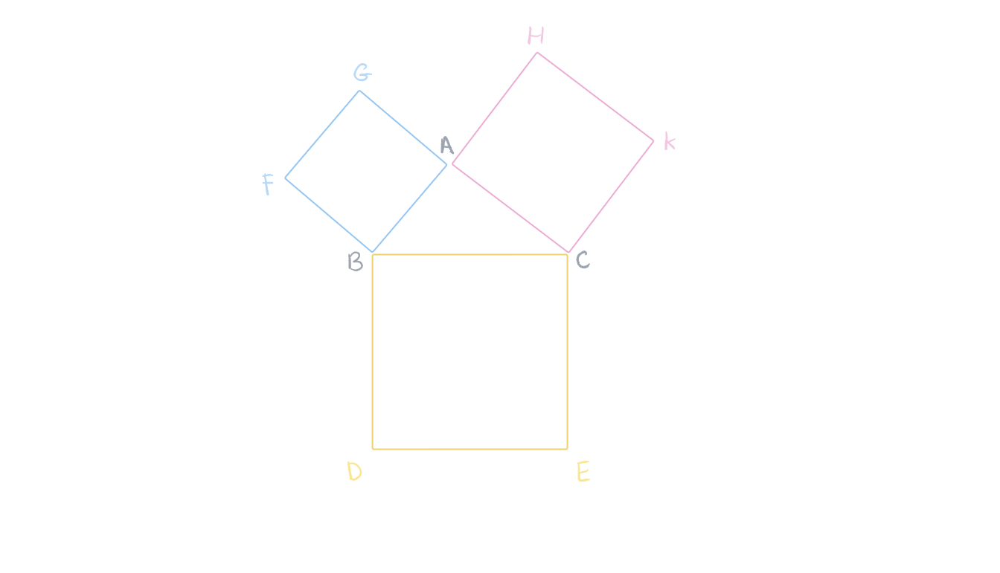
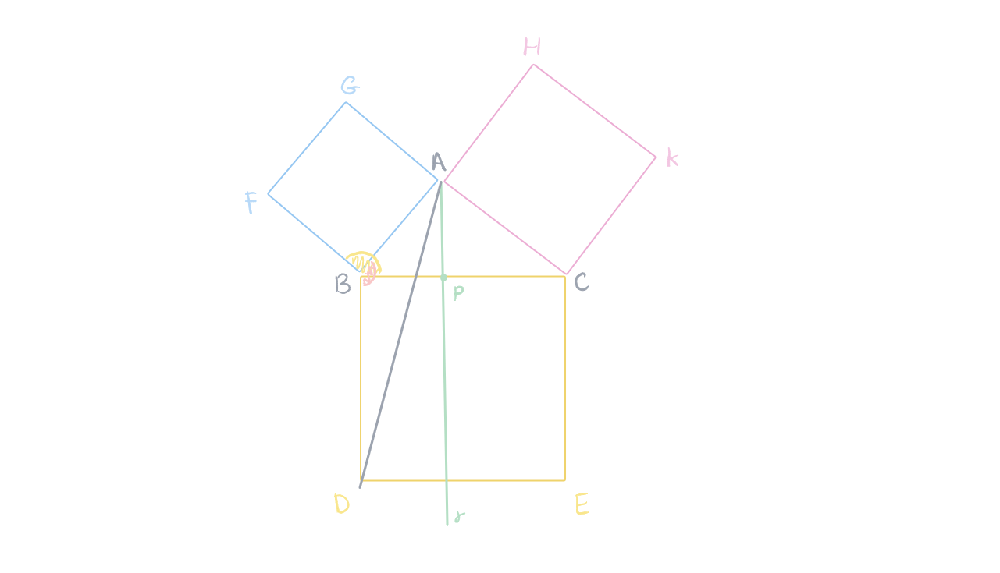
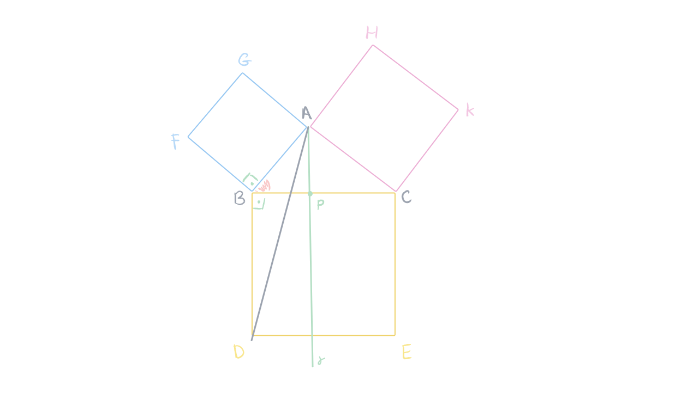
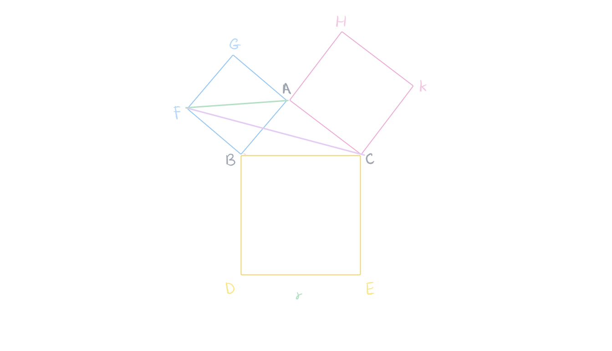
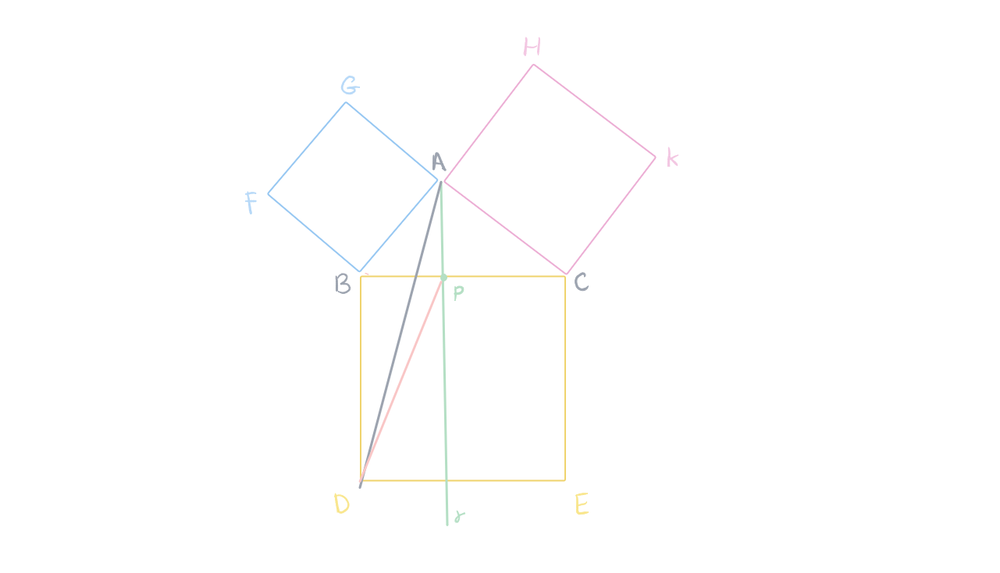
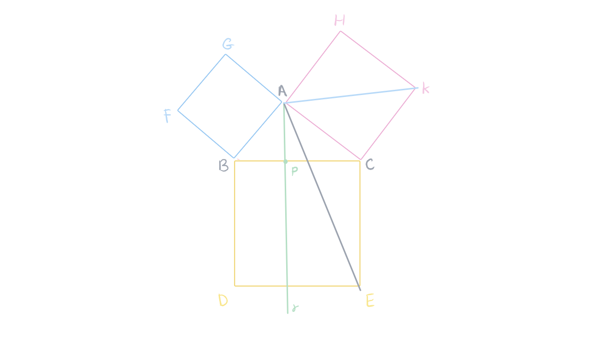

## Teorema
card-last-interval:: -1
card-repeats:: 1
card-ease-factor:: 2.6
card-next-schedule:: 2026-06-01T03:00:00.000Z
card-last-reviewed:: 2026-06-01T01:28:40.895Z
card-last-score:: 1
#+BEGIN_QUOTE
Se um triângulo $ABC$ é retângulo em $A$, a soma das áreas dos quadrados construídos sobre os catetos é igual à área do quadrado construído sobre a hipotenusa.
#+END_QUOTE
**Demonstração**: seja um triângulo retângulo em $A$. Construímos os quadrados sobre um dos lados do triângulo. #card 

	- Trace uma reta paralela $(r)$ ao segmento $[BD]$ e ao segmento $[CE]$ passando pelo ponto $A$.
	  $\overline{BF}=\overline{BA}$, pois $AGFB$ é quadrado.
	  $\overline{BD}=\overline{BC}$, pois $BCED$ é quadrado.
	  $\widehat{FBC}=\widehat{ABD}$, pois são compostos de um ângulo reto mais o ângulo $\widehat{ABC}$.
	  Logo temos que o triângulo $FBC$ é congruente ao triângulo $ABD$ pelo caso *LAL*, e, como são congruentes, possuem a **mesma área**
	   
	   
	  Os triângulos $FBA$ e $FBC$ possuem **mesma área**, pois estão construídos em um **mesmo lado** comum $[FB]$ e o **vértice** está em uma **paralela** à base.[^1]
	  
	  Os triângulos $ABD$ e $PBD$ possuem **mesma área**, pois estão construídos em um **mesmo lado** comum $[BD]$ e o **vértice** está em uma **paralela** à base.[^2]
	  
	  De acordo com as afirmações acima $ABFG$ tem a mesma área de $BPLD$, pois o triângulo $FBA$ é metade do quadrado $AGFB$, o triângulo $PDL$ é metade do retângulo $BDLP$, mas temos que o triângulo $FBA$ têm a mesma área que $FBC$ e o triângulo $BDP$ tem a mesma área que $ABD$ o que significa que, como $FBC$ e $ABD$ têm a mesma área por serem triângulos congruentes, $$FBA$$ e $BDP$ tem a mesma área pois têm áreas de triângulos congruentes. logo a área do quadrado $ABFG$ tem a mesma área de $BPLD$.
	  
	  Podendo repetir o mesmo raciocínio para o outro lado, o Teorema de Pitágoras é provado:
	  