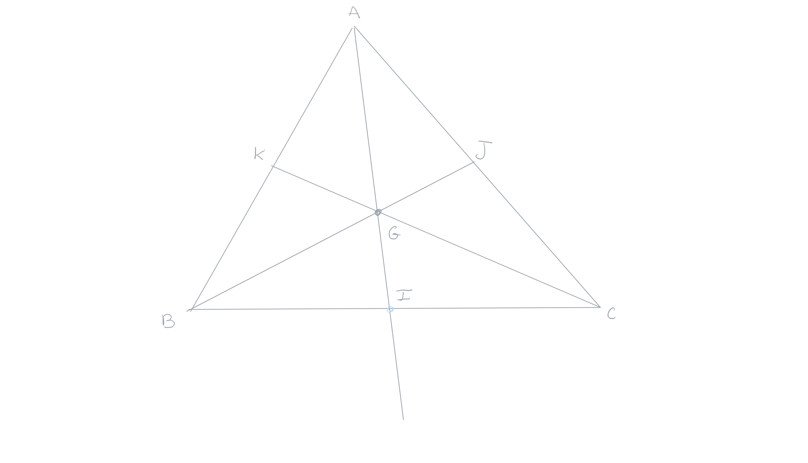
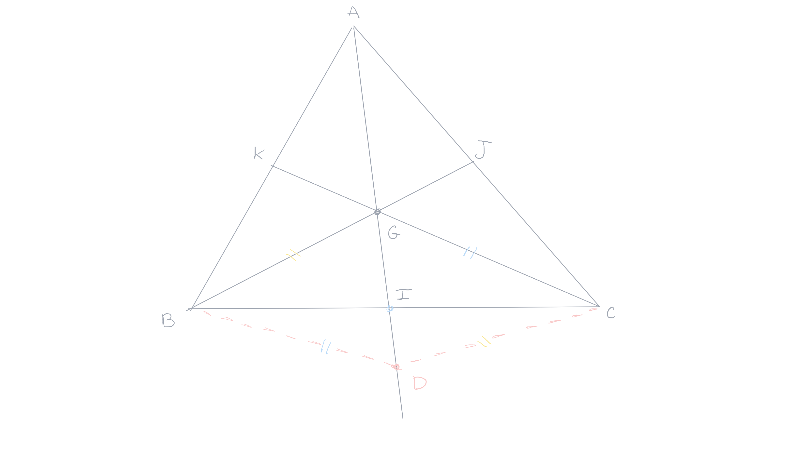

public:: true

- Created: [[May 26th, 2026]] 
  Updated:
  Subject: [[Geometria Euclidiana]] 
  Tags:
-
- ## 1. Teorema 
  #+BEGIN_QUOTE
  As medianas de um triângulo são concorrentes e o ponto de interseção se situa aos dois terços das medianas a partir dos vértices.
  #+END_QUOTE
  **Demonstração**: Seja um triângulo $ABC$, $J$ e $K$ os pontos médios dos lados $AC$ e $AB$. As medianas $BJ$ e $CK$ se encontram em $G$. Seja o ponto $D$ sobre a semirreta $[AG)$, tal que $G$ é ponto médio do segmento $[AD]$. Mostre que a semirreta $[AG)$ encontra o segmento $[BC]$ no seu ponto médio $I$ e que $AG=\frac{2}{3}AI$.
  
	- No triângulo $ADC$ a reta $(GJ)$ é a reta dos pontos médios. Esta reta é, portanto, paralela à reta $(DC)$. No triângulo $ABD$, a reta $(GK)$ é a reta dos pontos médios e, portanto, a reta $(GK)$ é paralela à reta $(DB)$ Observamos que a reta $(GJ)$ é também a reta $(BJ)$ e que a reta $(GK)$ é também a reta $(CK)$. O quadrilátero $GBDC$ que tem os seus lados paralelos dois a dois é um paralelogramo. As suas diagonais $DG$ e $BC$ se cortam no seu ponto médio $I$. O que mostra que $(AI)$ é a terceira mediana e que as medianas se encontram no ponto $G$. Temos, também, que: $AG=GD=2GI\implies{AG}=\frac{2}{3}AI$.
	  