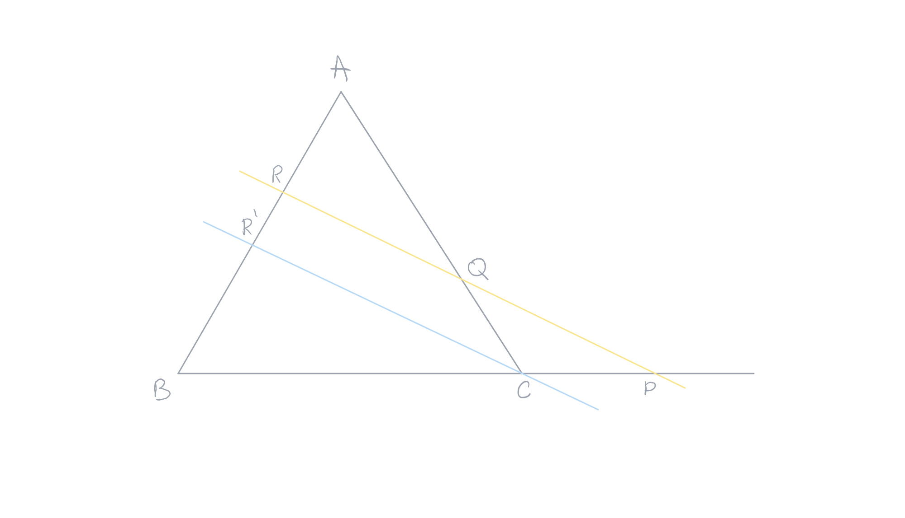
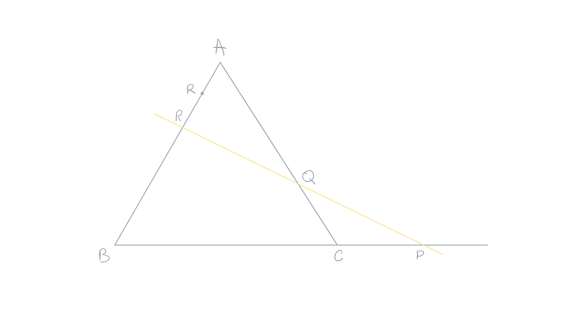

public:: true

- Created: [[May 21st, 2026]] 
  Updated:
  Subject: [[Geometria Euclidiana]] 
  Tags:
-
- ## 1. Teorema 
  card-last-score:: 5
  card-repeats:: 2
  card-next-schedule:: 2026-06-03T13:48:18.615Z
  card-last-interval:: 4
  card-ease-factor:: 2.6
  card-last-reviewed:: 2026-05-30T13:48:18.616Z
  #+BEGIN_QUOTE
  Seja um triângulo $ABC$. Sejam $P$ ponto de $(BC)$, $Q$ ponto de $(AC)$ e $R$ ponto de $(AB)$. Se $P$, $Q$ e $R$ são alinhados, então, vale a segunte relação: 
   
  #+BEGIN_CENTER
  $\frac{\overline{PB}}{\overline{PC}}\times\frac{\overline{QC}}{\overline{QA}}\times\frac{\overline{RA}}{\overline{RB}}=+1$
  #+END_CENTER 
  #+END_QUOTE
  **Demonstração**: no ponto $C$, traça-se a paralela à reta $(PQ)$. Esta reta intercepta a reta $(AC)$ em $R'$. #card 
  
	- Considerando os triângulos $RPB$ e $R'CB$: eles são triângulos são congruentes, pois possuem um vértice $B$ em comum e os lados opostos a este vértice estão sobre a mesma reta (por causa que $(CR')//(PR)$, logo temos: 
	  #+BEGIN_CENTER
	   
	  $\frac{\overline{PB}}{\overline{PC}}=\frac{\overline{RB}}{\overline{RR'}}$
	   
	  #+END_CENTER
	  Considerando os triângulos $RAQ$ e $R'AC$: eles são triângulos são congruentes, pois possuem um vértice $A$ em comum e os lados opostos a este vértice estão sobre a mesma reta (por causa que $(RP)//(R'C)$, logo temos: 
	  #+BEGIN_CENTER
	   
	  $\frac{\overline{QC}}{\overline{QA}}=\frac{\overline{RR'}}{\overline{RA}}$
	  #+END_CENTER
	  Temos, então: 
	  #+BEGIN_CENTER
	  $\frac{\overline{PB}}{\overline{PC}}\times\frac{\overline{QC}}{\overline{QA}}\times\frac{\overline{RA}}{\overline{RB}}=\frac{\overline{RB}}{\overline{RR'}}\times\frac{\overline{RR'}}{\overline{RA}}\times\frac{\overline{RA}}{\overline{RB}}=+1$
	  #+END_CENTER
- ## 2. Teorema Recíproco 
  card-last-interval:: 4
  card-repeats:: 2
  card-ease-factor:: 2.6
  card-next-schedule:: 2026-06-03T13:30:26.716Z
  card-last-reviewed:: 2026-05-30T13:30:26.716Z
  card-last-score:: 5
  #+BEGIN_QUOTE
  Seja um triângulo $ABC$ um triângulo. Os pontos $P$, $Q$ e $R$ pertencem, respectivamente, às retas $(BC)$, $(AC)$ e $(AB)$. Se vale a igualadade: 
  #+BEGIN_CENTER
  
  $\frac{\overline{PB}}{\overline{PC}}\times\frac{\overline{QC}}{\overline{QA}}\times\frac{\overline{RA}}{\overline{RB}}=+1$
  #+END_CENTER 
   
  então $P$, $Q$ e $R$ estão alinhados.  
  #+END_QUOTE
  **Demonstração**: suponhamos que $P$, $Q$ e $R$ não são alinhados. A reta $(PQ)$ intercepta a reta $(AC)$ no ponto $R'$. #card 
  
	- Como os pontos $P$, $Q$ e $R'$ são alinhados, temos, pelo Teorema de Menelaus: 
	  #+BEGIN_CENTER
	   
	  $\frac{\overline{PB}}{\overline{PC}}\times\frac{\overline{QC}}{\overline{QA}}\times\frac{\overline{R'A}}{\overline{R'B}}=+1$
	   
	  #+END_CENTER
	   Mas, por hipótese, temos também: 
	  #+BEGIN_CENTER
	   
	  $\frac{\overline{PB}}{\overline{PC}}\times\frac{\overline{QC}}{\overline{QA}}\times\frac{\overline{RA}}{\overline{RB}}=+1$
	   
	  #+END_CENTER
	  Dessas duas igualdades se deduz: 
	  #+BEGIN_CENTER
	   
	  $\frac{\overline{PB}}{\overline{PC}}\times\frac{\overline{QC}}{\overline{QA}}\times\frac{\overline{R'A}}{\overline{R'B}}=\frac{\overline{PB}}{\overline{PC}}\times\frac{\overline{QC}}{\overline{QA}}\times\frac{\overline{RA}}{\overline{RB}}\implies\cancel{\frac{\overline{PB}}{\overline{PC}}}\times\cancel{\frac{\overline{QC}}{\overline{QA}}}\times\frac{\overline{R'A}}{\overline{R'B}}=\cancel{\frac{\overline{PB}}{\overline{PC}}}\times\cancel{\frac{\overline{QC}}{\overline{QA}}}\times\frac{\overline{RA}}{\overline{RB}}\implies\frac{\overline{RA}}{\overline{RB}}=\frac{\overline{R'A}}{\overline{R'B}}$
	   
	  #+END_CENTER
	  Como há somente um ponto que divide o segmento $[AB]$ numa razão dada, temos $R=R'$.