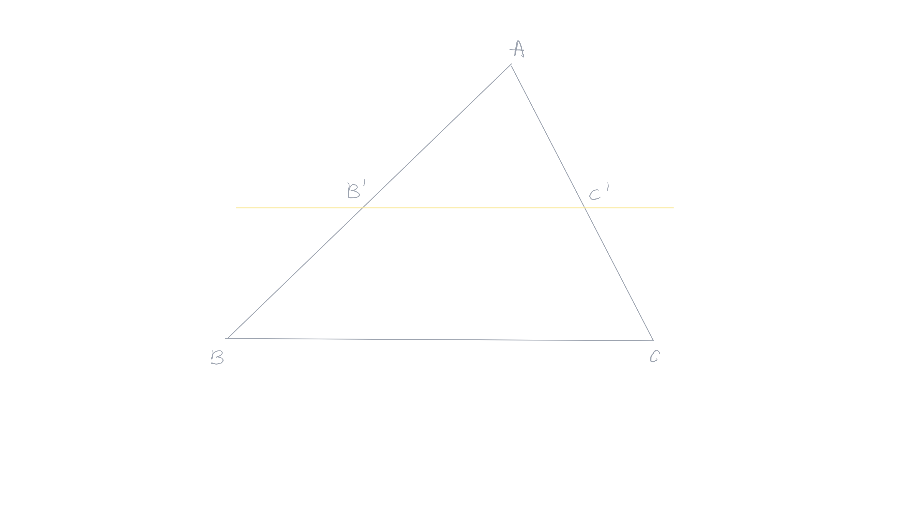
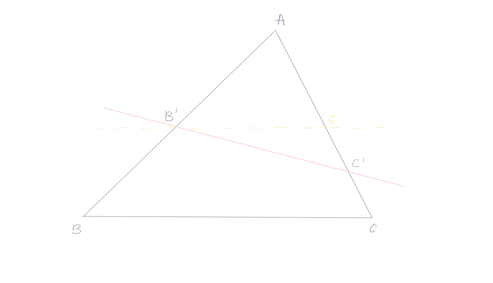

public:: true

- Created: [[May 18th, 2026]] 
  Updated: [[May 26th, 2026]] 
  Subject: [[Geometria Euclidiana]] 
  Tags:
-
- ## 1. Teorema
  card-last-interval:: 2.29
  card-repeats:: 2
  card-ease-factor:: 2.36
  card-next-schedule:: 2026-06-04T00:19:37.211Z
  card-last-reviewed:: 2026-06-01T18:19:37.211Z
  card-last-score:: 3
  #+BEGIN_QUOTE
  A intersecção de um feixe de retas paralelas por duas retas transversais forma segmentos proporcionais.
  #+END_QUOTE
  **Demonstração**: dado um triângulo $ABC$ e uma reta $(r)$, paralela à reta $(BC)$. A reta corta o lado $AB$ no ponto $B'$ e a reta $(AC)$ no ponto $C'$, então temos: #card
  #+BEGIN_CENTER
   
  $\frac{AB'}{AB}=\frac{AC'}{AC}$
    
  #+END_CENTER 
  
	- Os triângulos $AB'C'$ e $AC'B$ têm um vértice comum e os lados opostos a este vértice sobre a mesma reta. Então, se denotamos, por exemplo, a área de um triângulo $ABC$ por $A_{ABC}$, temos a igualdade de razões: 
	  #+BEGIN_CENTER
	   
	  $\frac{A_{AB'C'}}{A_{AC'B}}=\frac{AB'}{AB}$
	    
	  #+END_CENTER
	  Pois as áreas e os lados opostos ao vértice comum são proporcionais.
	   
	  Do mesmo modo e pelas mesmas razões, obtemos também: 
	  #+BEGIN_CENTER
	   
	  $\frac{A_{AB'C'}}{A_{AB'C}}=\frac{AC'}{AC}$.
	    
	  #+END_CENTER
	  As áreas dos triângulos $BB'C'$ e $CC'B'$ são iguais, pois estão construídos entre as mesmas paralelas. Somando a essas duas áreas com a área do triângulo $AB'C'$, obtemos $A_{AC'B}=A_{AB'C}$.
	  
	  Essas três igualdades permitem afirmar que: $\frac{AB'}{AB}=\frac{AC'}{AC}$.
- ## 2. Teorema Recíproco de Tales
  card-last-interval:: 4
  card-repeats:: 2
  card-ease-factor:: 2.6
  card-next-schedule:: 2026-06-05T17:51:12.784Z
  card-last-reviewed:: 2026-06-01T17:51:12.784Z
  card-last-score:: 5
  **Demonstração**: seja um triângulo $ABC$ e $B'$ e $C'$ dois pontos respectivamente dos segmentos $[AB]$ e $[AC]$. Se vale a igualdade $\frac{AB'}{AB}=\frac{AC'}{AC}$, então a reta $(B'C')$ é paralela à reta $(AB)$. Trace uma reta $(r)$ paralela ao lado $BC$ passando pelo ponto $B'$. Esta reta corta o lado $AC$ em $E$. #card
  
	- Como as retas $(BC)$ e $(B'E)$ são paralelas, temos $\frac{AB'}{AB}=\frac{AE}{AC}$.
	   
	  Mas, por hipótese, temos também $\frac{AB'}{AB}=\frac{AC'}{AC}$. Essas duas igualdade levam à: $\frac{AE}{AC}=\frac{AC'}{AC}$.
	   
	  Exite apenas um ponto interior ao segmento $[AC]$ que divide $AB$ numa razaão dada, então $E=C'$