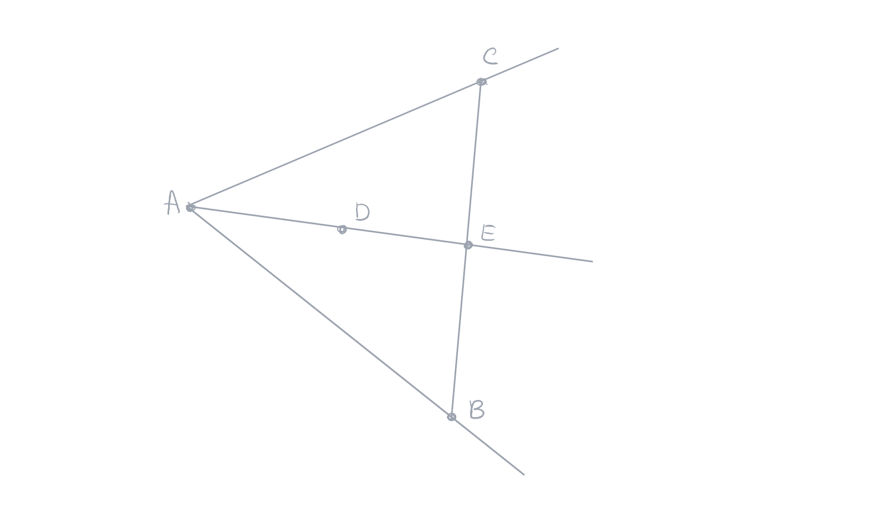

public:: true

- Created: [[May 16th, 2026]] 
  Updated:
  Subject: [[Geometria Euclidiana]]
  Tags: #end
-
- ## Proposição 2.3.3
  Seja $\widehat{BAC}$ um ângulo e $D$ um ponto em seu interior, então, a semirreta $[AD)$ e o segmento $[BC]$ se encontram.
  **Demonstração**: Considere as retas $r = (AB)$, $s=(AC)$ e $t=(AD)$. Existe um ponto $E$ tal que $E∗A∗C$. Por [[Pasch]], no triângulo $EBC$, temos $(AD)\cap[BC)\space{=}\mathllap{/\,}\space\empty$.
  
	- Aplicando o axioma de Pasch ao triângulo $EBC$ e à reta $(AD)$.
	  
	  Mostraremos primeiro que a reta $(AD)$ não encontra o segmento $EB$. O segmento $[EB]$ encontra a reta $r=(AB)$ em $B$. Assim todos os pontos de segmento $[EB]$, exceto $B$, estão em um mesmo lado que $E$ em relação à reta $r$. Os pontos $E$ e $C$ estão de lado oposto em relação à reta $r$. Mas como $D$ é interior ao ângulo $\widehat{BAC}$, todos os pontos de $[AD)$ estão do mesmo lado do que $C$ em relação à reta $r$ ou seja não encontram o segmento $[EB]$.
	  
	  Um raciocínio análogo mostraria que os pontos do segmento $[EB]$, exceto E, estão de um lado da reta $s=(AC)$, enquanto os pontos da semirreta $[Ax)$ oposta à semirreta $[AD)$ é do outro lado da reta $s$. O que demonstra que esta semirreta não encontra o segmento $[EB]$ bem como não encontra também o segmento $BC$.
	  
	  Aplicando o axioma de Pasch e a última observação, podemos concluir que a semirreta $[AD)$ encontra o segmento $BC$.