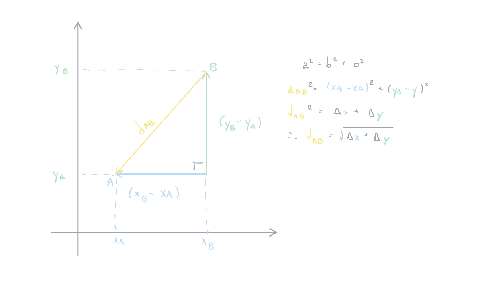

public:: true

- Created: [[Apr 19th, 2026]] 
  Updated: [[May 17th, 2026]] 
  Subject: [[Vetores no R2 e R3]] 
  Tags: #revisando
- ## Vetores e Escalares
  Os vetores ($\overrightarrow{u}, \overrightarrow{v},\overrightarrow{w}$) são diferentes de escalares ($\alpha, \beta, \theta$), pois os *escalares* são **números reais** ou **complexos** e os vetores não podem ser reduzidos a apenas um número já que seu sentido e sua direção importam. Em outras palavras, um *vetor* necessita de um **módulo** (comprimento), **direção e sentido**.
- ## Propriedades
  Comutatividade da soma:
  #+BEGIN_CENTER
  $\overrightarrow{u}+\overrightarrow{v}=\overrightarrow{v}+\overrightarrow{u}$
  #+END_CENTER
  Associatividade da soma:
  #+BEGIN_CENTER
  $\overrightarrow{u}+(\overrightarrow{v}+\overrightarrow{w})=(\overrightarrow{v}+\overrightarrow{u})+\overrightarrow{w}$
  #+END_CENTER
  Distributividade da soma:
  #+BEGIN_CENTER
  $\alpha(\overrightarrow{u}+\overrightarrow{v})=\alpha\overrightarrow{u}+\alpha\overrightarrow{v}$
  #+END_CENTER
  Elemento oposto: 
  #+BEGIN_CENTER
  $\overrightarrow{a}+(-\overrightarrow{a})=\overrightarrow{a}-\overrightarrow{a}=\overrightarrow{0}$
  #+END_CENTER
  Elemento neutro: 
  #+BEGIN_CENTER
  $\overrightarrow{a}+\overrightarrow{0}=\overrightarrow{0}+\overrightarrow{a}=\overrightarrow{a}$
  #+END_CENTER
- Formas de representar soma de vetores:
  #+BEGIN_CENTER
  $\overrightarrow{a}+\overrightarrow{b}=(6, -2) + (-4, 4)\implies(6+(-4)),(-2)+4)\implies\overrightarrow{a}+\overrightarrow{b}=(4, 2)$
  #+END_CENTER 
   
  #+BEGIN_CENTER
  ou
  #+END_CENTER 
    
  #+BEGIN_CENTER
  $\overrightarrow{a}+\overrightarrow{b}=\begin{bmatrix} 6 \\ -2\end{bmatrix}+\begin{bmatrix} -4 \\ 4\end{bmatrix}\implies\begin{bmatrix} 6+(-4) \\ (-2)+4\end{bmatrix}\implies\overrightarrow{a}+\overrightarrow{b}=\begin{bmatrix} 4 \\ 2\end{bmatrix}$
  #+END_CENTER
-
- ## Soma de vetores algebricamente
  
  + ==**Polar para retangular**==
  $$\overrightarrow{a}+\overrightarrow{b}=(a_x, a_y) + (b_x, b_y)\implies(x\times\cos{(\text{ângulo }a_x)}+(y\times\cos{(\text{ângulo }b_x})), (x\times\sin{(\text{ângulo }a_y)}+(y\times\sin{(\text{ângulo }b_y}))$$
- ## Distância Vetorial
  A fórmula da distância vetorial é obtida através do [[Teorema de Pitágoras]]: $||\overrightarrow{v}||=\sqrt{{v_1}^{2}+{v_2}^{2}+{v_3}^{2}}$
  
- ## Ângulos
  heading:: 2
  $$\overrightarrow{a}\times\overrightarrow{b}=|\overrightarrow{a}|\times|\overrightarrow{b}|\times\cos\theta\space\space\text{ ou }\space\space\cos\theta=\frac{\overrightarrow{a}\times\overrightarrow{b}}{|\overrightarrow{a}|\times|\overrightarrow{b}|}$$
  
  I. Se $$\overrightarrow{a}\times\overrightarrow{b}<0\implies\theta>90^o$$;
  II. Se $$\overrightarrow{a}\times\overrightarrow{b}=0\implies\theta=90^o$$;
  I. Se $$\overrightarrow{a}\times\overrightarrow{b}>0\implies\theta<90^o$$;
- ## Combinação linear
  heading:: 2
  O vetor $$c$$ é a combinação dos vetores $$a$$ e $$b$$ se pudermos escrever:
  $$c=\beta\times{a}+\alpha\times{b}$$
- {{colored-text #d9d898, "this is a test text, which should be colored"}}
- ## Referências
  REAMAT: Cálculo. **IME - UFRGS,** 2023. Disponível em: https://www.ufrgs.br/reamat/Calculo/livro-cfvv/xv-vetores_e_escalares.html. Acesso em: 17 maio 2026.