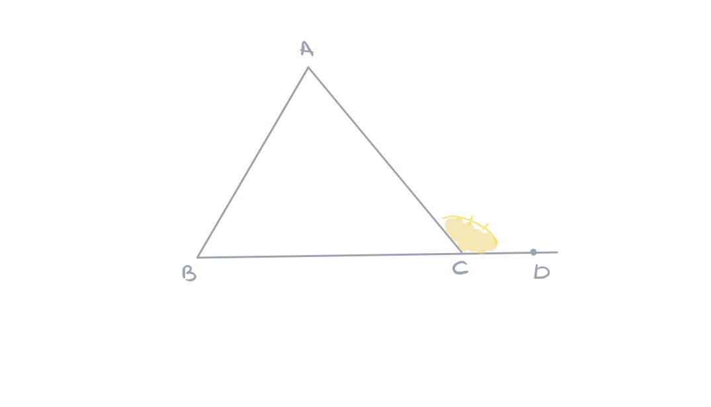
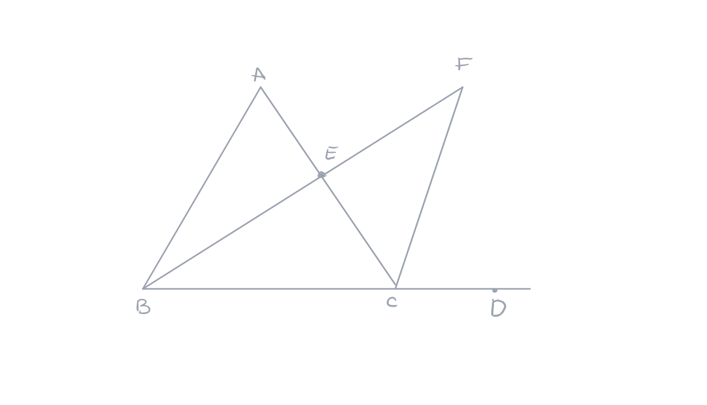
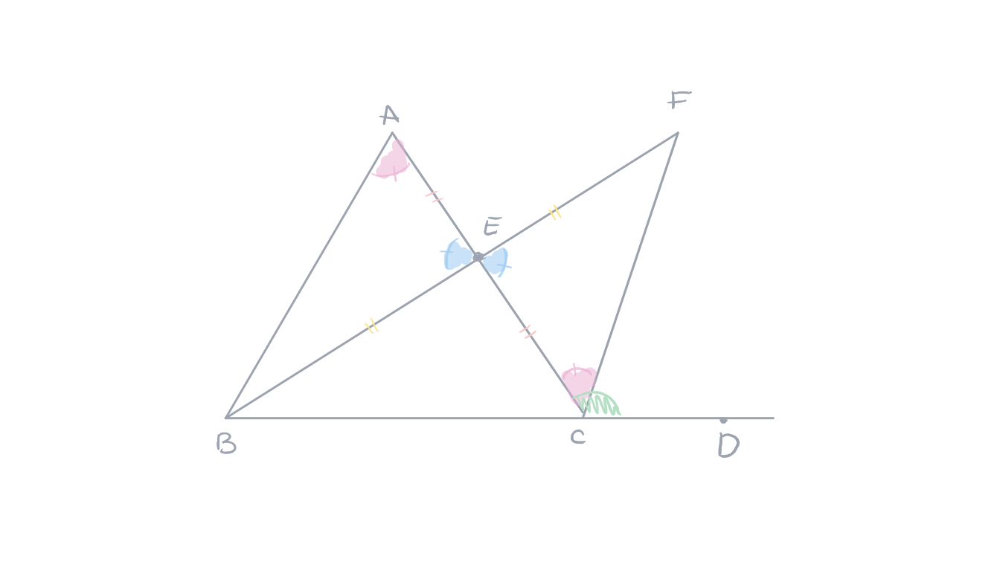
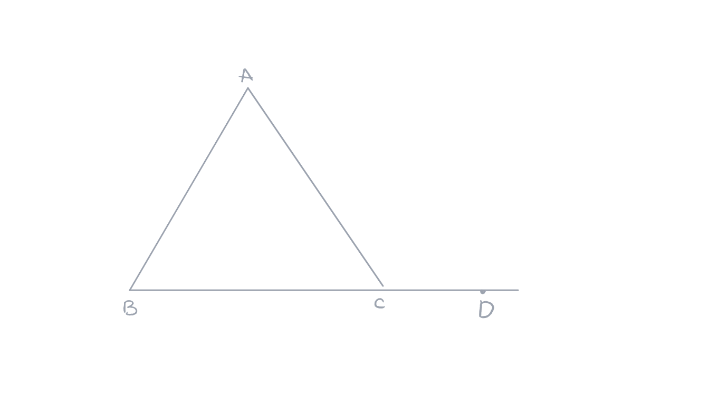
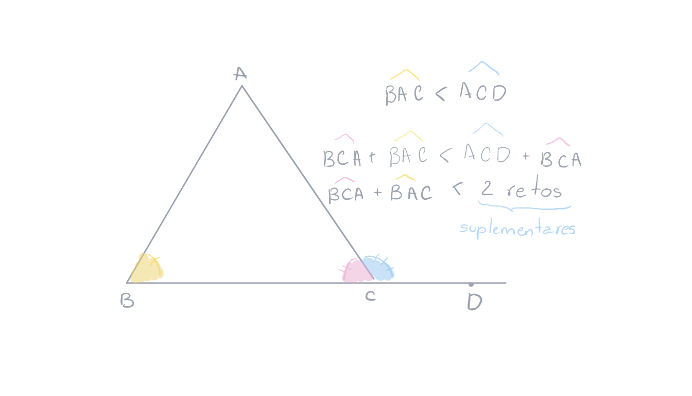
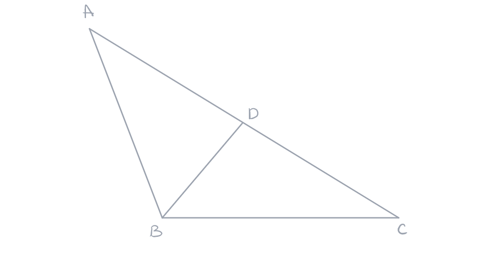
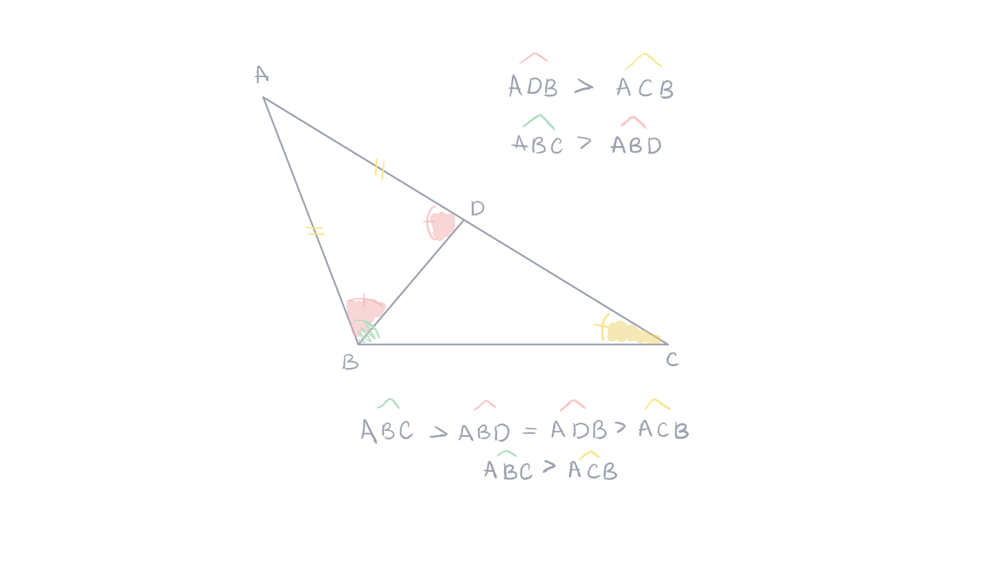
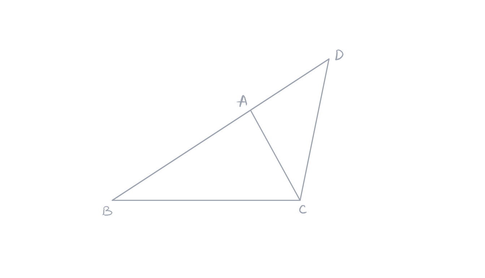
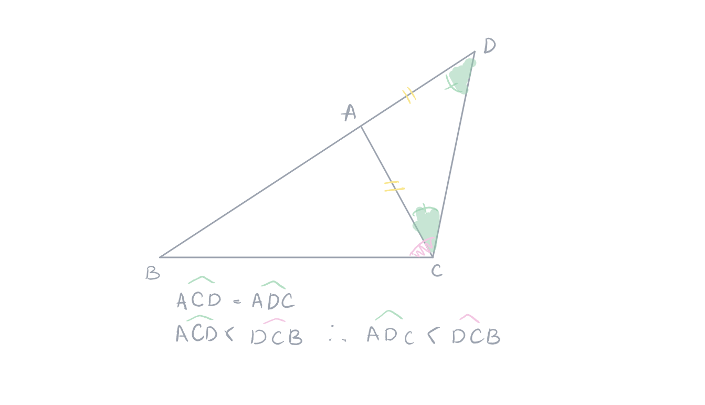

public:: true

- Created: [[May 16th, 2026]] 
  Updated:
  Subject: [[Geometria Euclidiana]]
-
- ## Definição
  Um ângulo externo de um triângulo é o ângulo suplementar de um ângulo do triângulo. O ângulo $\widehat{DCA}$ é um dos ângulos externos do triângulo $ABC$. Um triângulo tem seis ângulos externos.
  
- ## 1. Teorema 
  card-last-interval:: -1
  card-repeats:: 1
  card-ease-factor:: 2.5
  card-next-schedule:: 2026-06-02T03:00:00.000Z
  card-last-reviewed:: 2026-06-01T17:15:48.463Z
  card-last-score:: 1
  #+BEGIN_QUOTE
  O ângulo externo de um triângulo é maior do que cada um dos ângulos do triângulo que não lhe são adjacentes.
  #+END_QUOTE
  **Demonstração**: seja um triângulo $ABC$ e o ângulo externo $\widehat{ACD}$. Mostre que o ângulo $\widehat{ACD}$ é maior do que o ângulo $\widehat{BAC}$ sendo $E$ o ponto médio do segmento $[AC]$, trançando a semirreta $[BE)$, e o ponto $F$ desta semirreta tal que $E$ seja também o ponto médio do segmento $[BF]$. #card 
  
	- Comparando os triângulos $ABE$ e $CEF$ temos que os ângulos $\widehat{AEB}$ e $\widehat{CEF}$ são opostos pelo vértice e são, portanto, iguais. Temos também, por construção, $AE=EC$ e $BE=EF$.
	  
	  Pelo caso *LAL* os triângulos $AEB$ e $CEF$ são congruentes e, portanto, $\widehat{BAC}=\widehat{ACF}$. O ponto $F$ está no interior do ângulo $\widehat{ACD}$ [^1]. A semirreta $[BE)$ é interior ao ângulo $ABC$, pois $E$ está no segmento $AC$ o que significa que o ponto $F$ está do mesmo lado do que $A$ em relação à reta $(BC)$.
	  
	  Os pontos $B$ e $F$ são de lado oposto em relação à reta $(AC)$. Os pontos $B$ e $D$ são também de lado oposto em relação à reta $(AC)$. Logo o ponto $F$ é do mesmo lado do que $D$ em relação à reta $(BD)$, a semirreta $[AF)$ é interior ao ângulo $\widehat{ACD}$.
	  
	  Como o ângulo $\widehat{ACF}$ está dentro do ângulo $\widehat{ACD}$, o ângulo $\widehat{ACD}$ é maior do que o ângulo $\widehat{ACF}$ e, portanto, o ângulo $\widehat{ACD}$ é maior do que o ângulo $\widehat{BAC}$.
	  
- ## 2. Teorema
  card-last-interval:: 4
  card-repeats:: 2
  card-ease-factor:: 2.46
  card-next-schedule:: 2026-06-05T01:19:37.742Z
  card-last-reviewed:: 2026-06-01T01:19:37.743Z
  card-last-score:: 5
  #+BEGIN_QUOTE
  Para todo triângulo, a soma de dois ângulos do triângulo é menor do que dois ângulos retos.
  #+END_QUOTE
  **Demonstração**: seja um triângulo $ABC$. Vamos mostrar que a soma do ângulo $\widehat{BAC}$ e do ângulo $\widehat{BCA}$ é menor do que dois ângulos retos. #card
  
	- Pelo **1. Teorema**, sabemos que o ângulo $\widehat{BAC}$ é menor do que o ângulo externo $\widehat{ACD}$. Temos então $\widehat{BAC}<\widehat{ACD}$. Somando o ângulo $\widehat{ACB}$ aos dois membros desta desigualdade, obtemos: $\widehat{BAC}+\widehat{BCA}<\widehat{ACD}+\widehat{BCA}$. Como os ângulos $\widehat{BCA}$ e $\widehat{ACD}$ são suplementares, obtemos o resultado de que a soma de dois ângulos do triângulo é menor do que dois ângulos retos.
	  
- ## 3. Teorema
  card-last-interval:: 4
  card-repeats:: 2
  card-ease-factor:: 2.46
  card-next-schedule:: 2026-06-05T01:27:26.427Z
  card-last-reviewed:: 2026-06-01T01:27:26.427Z
  card-last-score:: 5
  #+BEGIN_QUOTE
  Para todo triângulo, o lado maior é interceptado pelo ângulo maior.
  #+END_QUOTE
  **Demonstração**: seja um triângulo $ABC$ e o lado $AC$ maior do que o lado $AB$. É possível mostrar que o ângulo $\widehat{ABC}$ é maior do que o ângulo $\widehat{ACB}$. Como $AC>AB$, existe um ponto $D$ do segmento $AC$ tal que $AD=AB$. #card 
  
	- O triângulo $ABD$ é isósceles por construção e seus ângulos $ABD$ e $ADB$ são portanto iguais. Considerando o triângulo $BDC$, o ângulo $ADB$ é um ângulo externo, e o teorema do ângulo externo permite afirmar que o ângulo $\widehat{ADB}$ é maior do que o ângulo $\widehat{ACB}$. Os pontos da semirreta $[BD)$ são anteriores ao ângulo $\widehat{ABC}$. O ângulo $\widehat{ABC}$ é maior do que o ângulo $\widehat{ABD}$.
	  
	  Obtemos assim: $\widehat{ABC}>\widehat{ABD}=\widehat{ADB}>\widehat{ACB}$, o que implica em $\widehat{ABC}>\widehat{ACB}$.
	  
- ## 4. Teorema
  card-last-interval:: 4
  card-repeats:: 2
  card-ease-factor:: 2.6
  card-next-schedule:: 2026-06-05T17:37:20.116Z
  card-last-reviewed:: 2026-06-01T17:37:20.117Z
  card-last-score:: 5
  #+BEGIN_QUOTE
  Para todo triângulo, a soma de dois lados é maior do que o terceiro.
  #+END_QUOTE
  **Demonstração**: seja um triângulo $ABC$. É possível mostrar que a soma dos dois lados $AB$ e $AC$ é maior do que o lado $BC$. Sobre a semirreta $[BA)$, seja o ponto $D$ de lado oposto a $B$ em relação ao ponto $A$, tal que $AD=AC$. #card 
  
	- O triângulo $ADC$ é isósceles $(AD=AC)$ e, portanto, o ângulo $\widehat{ACD}$ é igual ao ângulo $\widehat{ADC}$. Como a semirreta $[CA)$ é interior ao ângulo $DCB$, o ângulo $\widehat{ACD}$ é menor do que o ângulo $\widehat{DCB}$, e podemos também afirmar que o ângulo $\widehat{ADC}$ é menor do que o ângulo $\widehat{DCB}$. Considerando o triângulo $BCD$, o teorema "**para todo triângulo, o ângulo maior intercepta o lado maior**" nos permite concluir que o lado oposto ao ângulo $\widehat{BCD}$ é maior do que o lado oposto ao ângulo $\widehat{BDC}$, ou seja, $BD>BC$, mas o lado $BD$ é a soma de $AB$ e $AC$, o que acaba a demonstração.
	  
- ## Referências
  [^1]: Proposição 2.3.3: [[Teorema do Encontro]]
  
  GRIMBERG, Gérard Emile. **Teoremas da Geometria Euclidiana**: Propriedades geométricas. 6 p.