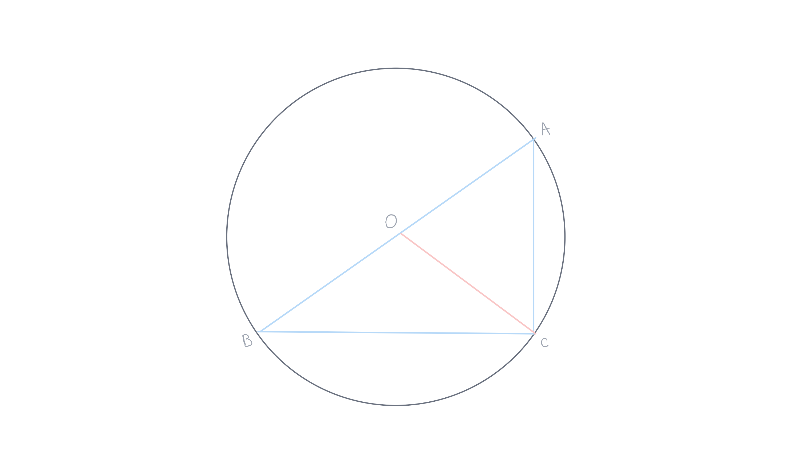
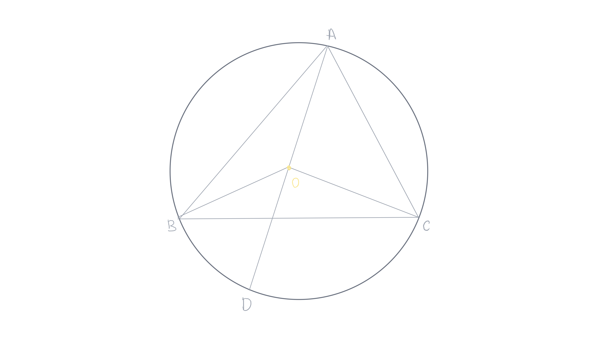
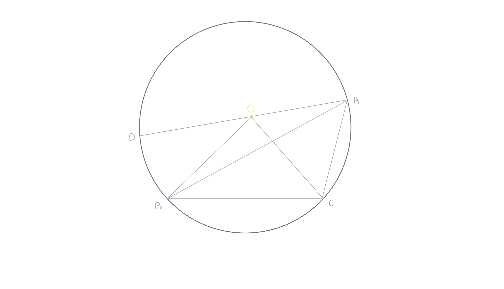
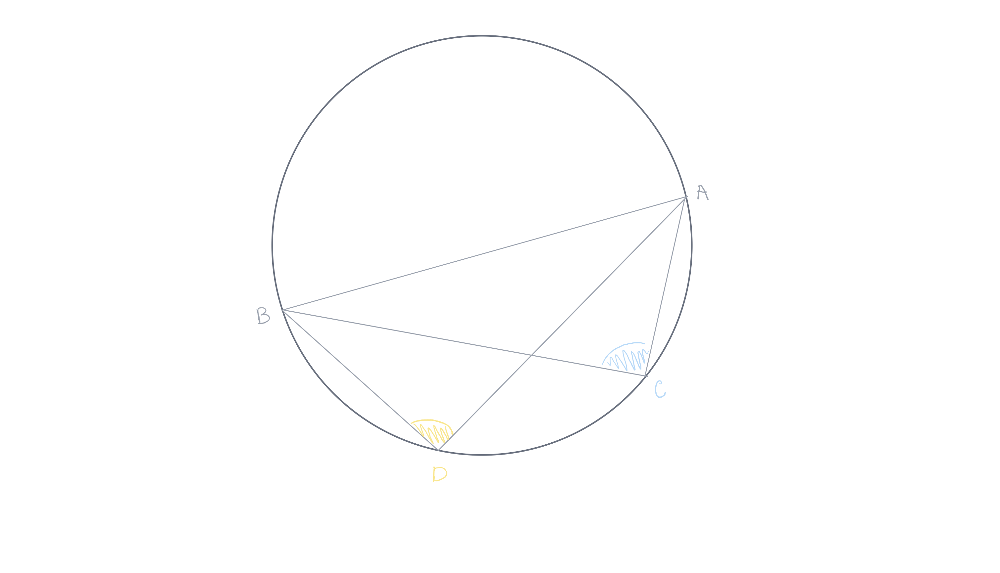

public:: true

- Created: [[May 15th, 2026]] 
  Updated: [[May 26th, 2026]] 
  Subject: [[Geometria Euclidiana]]
-
- ## 1. Teorema
  #+BEGIN_QUOTE
  Em um círculo, o ângulo central é o dobro do ângulo que intercepta o mesmo arco.
  #+END_QUOTE
	- **Demonstração**: sejam um círculo de centro $O$. Sejam $A$, $B$ e $C$ três pontos do círculo. Mostre que $\widehat{BAC}=\frac{1}{2}\widehat{BOC}$.
	  card-last-interval:: -1
	  card-repeats:: 1
	  card-ease-factor:: 2.5
	  card-next-schedule:: 2026-05-31T03:00:00.000Z
	  card-last-reviewed:: 2026-05-30T12:52:58.199Z
	  card-last-score:: 1
	  
	  **1.** O centro $O$ pertence ao lado $AB$. #card
	  
		- O triângulo $OAC$ é isósceles, e o ângulo $\widehat{OAC}$ é igual ao ângulo $\widehat{ACO}$. A soma dos dois ângulos $\widehat{OAC}$ e $\widehat{ACO}$ é igual a dois retos menos $\widehat{AOC}$. Como o ângulo central $\widehat{BOC}$ é suplementar do ângulo $\widehat{AOC}$, o ângulo $\widehat{BOC}$ é igual a soma dos dois ângulos $\widehat{OAC}$ e $\widehat{ACO}$. O ângulo $\widehat{BOC}$ é, portanto, o dobro de $\widehat{OAC}$ que é também o ângulo $\widehat{BAC}$.
	- **Demonstração**: sejam um círculo de centro $O$. Sejam $A$, $B$ e $C$ três pontos do círculo. Mostre que $\widehat{BAC}=\frac{1}{2}\widehat{BOC}$.
	  card-last-interval:: -1
	  card-repeats:: 1
	  card-ease-factor:: 2.5
	  card-next-schedule:: 2026-06-01T03:00:00.000Z
	  card-last-reviewed:: 2026-06-01T02:09:29.474Z
	  card-last-score:: 1
	  
	  **2.** O centro $O$ está interior ao ângulo $\widehat{BAC}$. #card
	  
		- Utilizando o caso **1** já demonstrado, temos: 
		  #+BEGIN_CENTER
		   
		  $\widehat{BAC}=\widehat{BAD}+\widehat{DAC}=\frac{1}{2}\widehat{BOD}+\frac{1}{2}\widehat{DOC}=\frac{1}{2}\widehat{BOC}$
		  #+END_CENTER
	- **Demonstração**: sejam um círculo de centro $O$. Sejam $A$, $B$ e $C$ três pontos do círculo. Mostre que $\widehat{BAC}=\frac{1}{2}\widehat{BOC}$
	  card-last-interval:: -1
	  card-repeats:: 1
	  card-ease-factor:: 2.5
	  card-next-schedule:: 2026-06-01T03:00:00.000Z
	  card-last-reviewed:: 2026-06-01T01:41:31.022Z
	  card-last-score:: 1
	   
	  **3.** O centro $$O$$ está fora do ângulo $\widehat{BAC}$ #card
	  
		- Utilizando o caso **1** já demonstrado, temos:
		  #+BEGIN_CENTER
		   
		  $\widehat{BAC}=\widehat{DAC}-\widehat{DAB}=\frac{1}{2}\widehat{DOC}-\frac{1}{2}\widehat{DOB}=\frac{1}{2}\widehat{BOC}$
		  #+END_CENTER
-
- ## 2. Teorema 
  card-last-interval:: -1
  card-repeats:: 1
  card-ease-factor:: 2.5
  card-next-schedule:: 2026-05-31T03:00:00.000Z
  card-last-reviewed:: 2026-05-30T12:32:09.043Z
  card-last-score:: 1
  #+BEGIN_QUOTE
  Os ângulos inscritos que interceptam o mesmo arco são iguais.
  #+END_QUOTE
  **Demonstração**: os dois ângulos inscritos, sendo a metade do mesmo ângulo central, são igual. #card
  
	- Seja uma circunferência de centro $O$. Considere o arco $\overgroup{AB}$. Sejam $C$ e $D$ dois pontos distintos sobre a circunferência, situados no arco oposto a $\overgroup{AB}$, de modo que os ângulos $\widehat{ACB}$ e $widehat{ADB}$ interceptem o arco $\widehat{AB}$.
	   
	  Pelo teorema do ângulo inscrito, a medida de um ângulo inscrito é igual à metade da medida do arco por ele interceptado. Assim: 
	  #+BEGIN_CENTER
	   
	  $m(\widehat{ACB})=\frac{1}{2}m\overgroup{AB}\space\space\text{e}\space\space{m}(\widehat{ADB})=\frac{1}{2}m\overgroup{AB}$
	  #+END_CENTER
	   
	  Logo, $m(\widehat{ACB})=m(\widehat{ADB})$. Portanto, os ângulos são iguais.